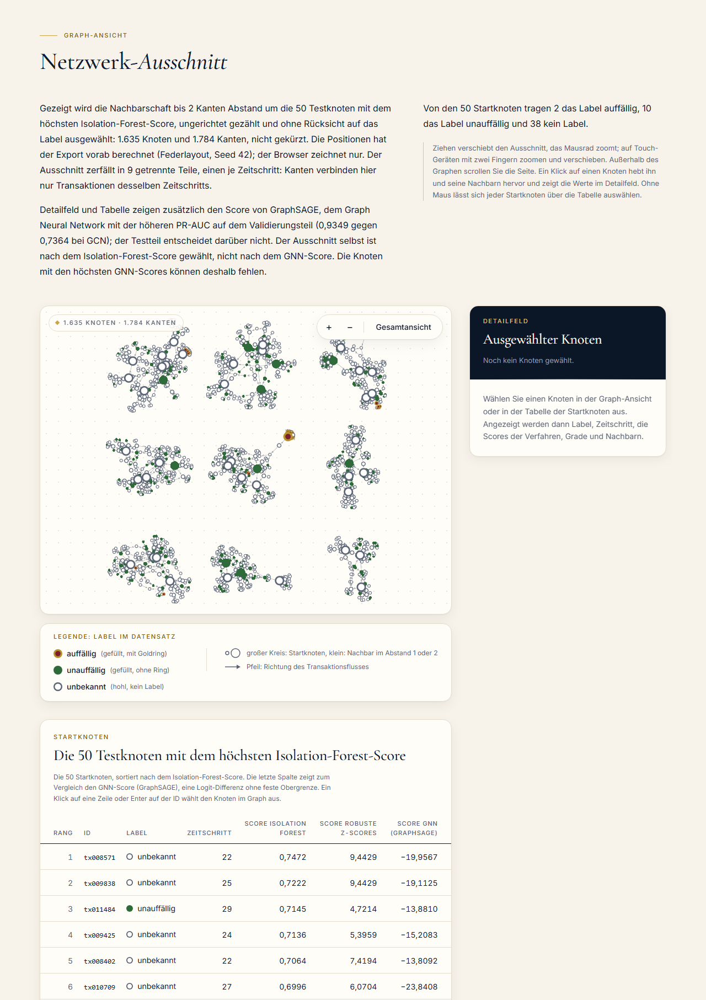
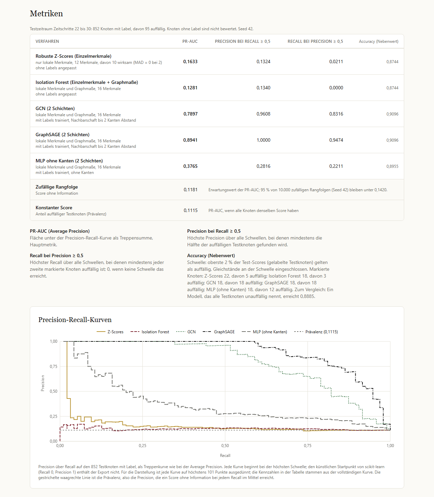

# NetzRadar

Anomalie-Erkennung in Transaktionsnetzwerken: klassische Baseline gegen Graph Neural Networks. Zeitlicher Split, PR-AUC statt Accuracy, feste Seeds, vorberechnete Ergebnisse, statische Visualisierung.

[](https://github.com/mirkan-morgenfels-ai/netzradar/actions/workflows/ci.yml)
[](./LICENSE)

Live-Demo: https://netzradar.vercel.app/projects/netzradar

## Auf einen Blick / At a glance

- **Frage:** Wie viel gewinnt ein Graph Neural Network, das die Nachbarschaft einer Transaktion einbezieht, gegenüber Baselines auf lokalen Merkmalen, bei gleichem zeitlichem Split, gleichen Testknoten und gleichen Metriken?
- **Aufbau:** eigenes synthetisches Transaktionsnetz (12.000 Knoten, 30 Zeitschritte, eingebaute Fan-in-, Fan-out-, Kreis- und Kettenmuster), Training auf den Zeitschritten 1 bis 21, Test auf 22 bis 30, PR-AUC als Hauptmetrik. Alle Ergebnisse sind vorab berechnet; die CI trainiert sie bei jedem Push auf `main` und in jedem Pull Request neu und vergleicht sie mit den eingecheckten Dateien.
- **Ergebnis mit MLP-Kontrolle:** GraphSAGE (0,8941) und GCN (0,7897) liegen weit über den Baselines (0,1633 und 0,1281) und über einer zufälligen Rangfolge (0,1181). Ein MLP gleicher Größe mit denselben Labels und derselben Auswahl, aber ohne Kanten, erreicht 0,3765. Gegenüber diesem MLP kommt auf diesem Netz der größere Teil des Vorsprungs aus der Nachbarschaft.
- **Homophilie-Vorbehalt:** 97,6 % der Kanten zwischen zwei gelabelten Knoten verbinden gleiche Labels. Der Vorsprung der Nachbarschaft ist im Generator deshalb zum Teil eingebaut und nicht auf reale Transaktionsdaten übertragbar.

| Verfahren | PR-AUC (Seed 42) | Mittel (Spanne) über Seeds 42–46 |
|---|---|---|
| Robuste Z-Scores | 0,1633 | – (ohne Zufall) |
| Isolation Forest | 0,1281 | – (nur Seed 42 gerechnet) |
| GCN | 0,7897 | 0,8002 (0,7897 bis 0,8148) |
| GraphSAGE | 0,8941 | 0,8842 (0,8689 bis 0,8941) |
| MLP ohne Kanten (Kontrolle) | 0,3765 | 0,3784 (0,3418 bis 0,4010) |

Seed 42 war vorab festgelegt. Die Werte über die Seeds 42 bis 46 stammen aus `hyperparameters.seedSpread` in `docs/runs/2026-10-06_synthetic_{gcn,graphsage,mlp}.json`.

**English summary.**

- NetzRadar is a reproducible case study in graph-based fraud and anti-money-laundering detection. It compares a classical baseline (robust z-scores, Isolation Forest with graph centrality features) with Graph Neural Networks (GCN and GraphSAGE in PyTorch Geometric) on a transaction network, using a strict temporal train/test split and precision-recall metrics suited to a rare positive class.
- Models are trained offline. The web page renders precomputed results from static JSON (an interactive subgraph around the 50 test nodes with the highest Isolation Forest scores plus a metrics table), with no model and no API call at runtime.
- Results (runs of 6 October 2026, seed 42) on a synthetic transaction network with planted laundering patterns: on its test period GraphSAGE reaches a PR-AUC of 0.8941 and GCN 0.7897, against 0.1633 for the robust z-scores and 0.1281 for the Isolation Forest (expected PR-AUC of a random ranking 0.1181, 95th percentile 0.1420). Over seeds 42 to 46 the means are 0.8842 (GraphSAGE), 0.8002 (GCN) and 0.3784 (MLP).
- A control MLP of the same size, trained on the same labels and selected by the same procedure but without edges, reaches 0.3765. Its distance to the baselines mixes supervision, the change of model and the four graph features; GCN and GraphSAGE add 0.41 and 0.52 on top of the MLP, so compared with this MLP most of the gain on this network comes from the neighbourhood. A strong supervised model without edges (random forest, gradient boosting) is not part of the comparison. The synthetic network is strongly homophilous (97.6 % of the edges between two labelled nodes join equal labels), so part of that advantage is built into the generator; the numbers say nothing about real transaction data.
- CI retrains all five methods on every push to main and every pull request and reproduces the committed results within 1e-4 on Linux. Raw datasets are not redistributed; see the dataset section for licences.

## Fragestellung

Betrug und Geldwäsche sind Netzwerkphänomene. Ein Konto mit unauffälligen eigenen Merkmalen wird verdächtig, wenn seine Nachbarn verdächtig sind, wenn Geld im Kreis läuft oder wenn viele kleine Beträge auf einen Knoten zulaufen. Die Frage dieses Projekts: Wie viel gewinnt ein Modell, das die Nachbarschaft einbezieht (GNN), gegenüber einem Modell, das nur die Merkmale des einzelnen Knotens sieht (Baseline), bei gleichem Split und gleichen Metriken?

## Ergebnisse

Datensatz: synthetisches Transaktionsnetz aus dem eigenen Generator (MIT, Seed 42) mit 12.000 Knoten, 13.757 gerichteten Kanten, 30 Zeitschritten und 12 lokalen Merkmalen. Split: zeitlich, Training auf den Zeitschritten 1 bis 21 (Validierungsteil 18 bis 21 innerhalb des Trainings), Test auf 22 bis 30, 0 Kanten zwischen Trainings- und Testknoten. Seed: 42. Stand: Läufe vom 06.10.2026 (UTC, `date` in `metrics.json`).

Bewertet werden nur gelabelte Testknoten: 95 illicit und 757 licit; `unknown` ist ausgeschlossen. Die Prävalenz beträgt 95 / 852 = 0,1115; so hoch ist die PR-AUC eines konstanten Scores. Eine zufällige Rangfolge erreicht im Erwartungswert etwas mehr, 0,1181, weil die Average Precision die Precision nur an den Rängen der illicit-Knoten mittelt und ein illicit-Knoten auf Rang k sich selbst mitzählt; der Effekt ist bei kleinem k am größten. 95 % von 10.000 zufälligen Rangfolgen (Seed 42) bleiben unter 0,1420. Gegen diese Werte sind die Zeilen zu lesen (`evaluation.randomPrAucExpected` und `evaluation.randomPrAucQ95` in `metrics.json`).

| Verfahren | Merkmale | PR-AUC | Precision bei Recall ≥ 0,5 | Recall bei Precision ≥ 0,5 |
|---|---|---|---|---|
| Robuste Z-Scores (Einzelmerkmale) | 12 lokale, davon 10 wirksam | 0,1633 | 0,1324 | 0,0211 |
| Isolation Forest (Einzelmerkmale + Graphmaße) | 12 lokale + 4 Graphmaße | 0,1281 | 0,1340 | 0,0000 |
| GCN (2 Schichten) | 12 lokale + 4 Graphmaße, Nachbarschaft bis 2 Hops | 0,7897 | 0,9608 | 0,8316 |
| GraphSAGE (2 Schichten) | 12 lokale + 4 Graphmaße, Nachbarschaft bis 2 Hops | 0,8941 | 1,0000 | 0,9474 |
| Kontrolle: MLP ohne Kanten (2 Schichten) | 12 lokale + 4 Graphmaße | 0,3765 | 0,2816 | 0,2211 |
| Zufällige Rangfolge (Erwartungswert; 95 % unter 0,1420) | – | 0,1181 | – | – |
| Konstanter Score (Prävalenz) | – | 0,1115 | – | – |

Bei den Z-Scores haben `f_round_amount` und `f_change_output` auf den Trainingsknoten MAD = 0 und tragen nichts bei; wirksam sind 10 der 12 lokalen Merkmale (`hyperparameters.zeroMadFeatures`).

GCN, GraphSAGE und MLP sind überwacht trainiert (Labels der Trainingszeitschritte 1 bis 21), die beiden Baselines nicht. Gewählt wurde je Verfahren nur am Validierungsteil 18 bis 21 (Abschnitt Methodik); alle drei wählten den Merkmalssatz mit Graphmaßen:

| Verfahren | Gewicht der Positivklasse | gewählte Epoche | Validierungs-PR-AUC | Test-PR-AUC über Seeds 42 bis 46 (Spanne, Mittel) |
|---|---|---|---|---|
| GCN | 20 (fest) | 140 | 0,7364 | 0,7897 bis 0,8148, Mittel 0,8002 |
| GraphSAGE | 9,2893 (licit / illicit im Training: 1.830 / 197) | 300 (Obergrenze) | 0,9349 | 0,8689 bis 0,8941, Mittel 0,8842 |
| MLP ohne Kanten | 20 (fest) | 16 | 0,4970 | 0,3418 bis 0,4010, Mittel 0,3784 |

Berichtet wird Seed 42, der vorab festgelegt war. Die Spanne über die Seeds 42 bis 46 stammt aus den Laufprotokollen (`hyperparameters.seedSpread` in `docs/runs/*_synthetic_{gcn,graphsage,mlp}.json`) und steht auch in der Tabelle „Auf einen Blick“; die Seite zeigt sie nicht. Sie zeigt, wie viel der Kennzahl vom Zufall der Initialisierung und der Dropout-Masken abhängt. `scoreGnn` in `data/k3/nodes.json` stammt von GraphSAGE, weil GraphSAGE die höhere Validierungs-PR-AUC hat (`scoreGnnMethod`, verglichen auf 4 Nachkommastellen wie im Export, bei Gleichstand GCN); der Test entscheidet darüber nicht.

Precision bei Recall ≥ 0,5 ist die höchste Precision über alle Schwellen, bei denen mindestens die Hälfte der illicit-Testknoten gefunden wird. Recall bei Precision ≥ 0,5 ist der höchste Recall über alle Schwellen, bei denen mindestens jeder zweite markierte Knoten illicit ist; 0 heißt, dass keine Schwelle das erreicht.

Accuracy als Nebenwert, wenn die obersten 2 % der Test-Scores als auffällig gelten; Gleichstände an der Schwelle zählen mit: beide Baselines 0,8744. Ein Modell, das alles licit nennt, erreicht 0,8885. Der Isolation Forest markiert 18 Knoten mit 3 Treffern: (852 − 15 − 92) / 852. Die robusten Z-Scores markieren wegen Gleichständen an der Schwelle 22 Knoten mit 5 Treffern: (852 − 17 − 90) / 852. Beides ergibt 745 / 852 = 0,8744 (`accuracyFlagged` und `accuracyTruePositives` in `metrics.json`). GCN und GraphSAGE markieren je 18 Knoten, alle 18 sind illicit: (852 − 0 − 77) / 852 = 775 / 852 = 0,9096. Das MLP markiert 18 mit 12 Treffern: (852 − 6 − 83) / 852 = 763 / 852 = 0,8955. Selbst die fehlerfreie Spitze der GNN liegt damit nur 0,0211 über „alles licit“, weil 2 % von 852 Knoten höchstens 18 der 95 illicit-Knoten erfassen. Genau deshalb ist Accuracy hier keine Hauptmetrik.

**Einordnung.** Die Zahlen sind auf einem synthetischen Netz mit eingebauten Mustern gemessen und sagen nichts über reale Transaktionsdaten aus. Die robusten Z-Scores liegen mit 0,1633 über dem 95-%-Quantil zufälliger Rangfolgen (0,1420) und ordnen auffällige Knoten damit etwas besser als Zufall. Der Isolation Forest liegt mit 0,1281 darunter und ist von einer zufälligen Rangfolge (Erwartungswert 0,1181) nicht zu unterscheiden. Ob das am Verfahren oder an den zusätzlichen Graphmaßen liegt, lässt sich aus diesen zwei Läufen nicht ablesen, weil sich beides gleichzeitig unterscheidet. Von seinen 50 höchsten Testknoten (die Startknoten in `data/k3/nodes.json`) sind 2 illicit, 10 licit und 38 unknown. Ihr Median-Grad (ein- plus ausgehend) liegt bei 13, der mittlere Grad im ganzen Netz bei 2 · 13.757 / 12.000 ≈ 2,29. Der Isolation Forest hält also vor allem stark vernetzte gutartige Knoten für auffällig: Der gutartige Hintergrund des Generators wächst durch Preferential Attachment und bildet Hubs, und Hubs sind strukturelle Ausreißer. Die meisten lokalen Merkmale der Musterknoten sind bewusst nur um 0,5 Standardabweichungen verschoben (`localShift`). Deutlich stärker weicht der größte Ausgangsanteil der Fan-out-Verteiler ab, und runde Beträge sind bei Musterknoten doppelt so häufig. Fan-in-Sammler haben als Summe vieler Zubringer einen höheren Betrag und einen kleineren Variationskoeffizienten der Eingangsbeträge (die Beträge der Zubringer streuen weniger). Einzelheiten in [`docs/daten.md`](docs/daten.md). Das Signal steckt vor allem in der Netzstruktur (Fan-in, Fan-out, Kreise, Ketten, illicit-Nachbarschaften). Die Generator-Parameter wurden nach dem ersten Ergebnis nicht nachjustiert, auch nicht nach den GNN-Läufen.

**Einordnung der GNN.** GraphSAGE (0,8941) und GCN (0,7897) liegen weit über beiden Baselines und über dem 95-%-Quantil zufälliger Rangfolgen (0,1420). Dieser Abstand mischt aber mehrere Effekte: Die GNN lernen aus Labels (197 illicit und 1.830 licit Trainingsknoten), die Baselines nicht; sie nutzen zusätzlich die Graphmaße, die bessere Baseline (Z-Scores) nur lokale Merkmale; und nur die GNN sehen die Nachbarschaft. Die Kontrollvariante trennt die Nachbarschaft von den übrigen Effekten: Das MLP hat dieselbe Größe (2 Schichten, 64 Einheiten), dieselbe Suche über Merkmalssätze und Klassengewichte, dieselben Trainingsdaten und dieselbe Auswahl am Validierungsteil, aber keine Kanten. Merkmalssatz, Gewicht und Epochenzahl wählt die Suche je Verfahren getrennt (Tabelle oben). Das MLP erreicht 0,3765. Auf diesem Netz entfallen damit grob 0,3765 − 0,1633 = 0,21 auf Überwachung, Verfahrenswechsel und die vier Graphmaße zusammen (MLP gegen die bessere Baseline). Dieser Abstand trennt die Labels nicht von den Graphmaßen: Das MLP nutzt lokale Merkmale und Graphmaße, die Z-Scores nur lokale, und am Validierungsteil hebt der Merkmalssatz mit Graphmaßen das MLP von 0,2722 (bester Kandidat nur mit lokalen Merkmalen) auf 0,4970. Sauberer sind die Abstände 0,7897 − 0,3765 = 0,41 (GCN) bzw. 0,8941 − 0,3765 = 0,52 (GraphSAGE) für die Nachbarschaft, weil GNN und MLP dieselben Kandidaten durchlaufen und alle drei den Merkmalssatz mit Graphmaßen gewählt haben. Gegenüber dem MLP gleicher Größe ohne Kanten kommt auf diesem Netz damit der größere Teil des Vorsprungs aus der Nachbarschaft. Ein starkes überwachtes Verfahren ohne Kanten (Random Forest, Gradient Boosting) fehlt im Vergleich; ob es den Abstand verkleinert, ist nicht gemessen. Auf Elliptic lag bei Weber et al. (2019), gemessen mit dem F1-Wert der illicit-Klasse, ein Random Forest vor dem GCN. Beide Abstände sind deutlich größer als die Streuung über die Seeds 42 bis 46: Die Spannen von MLP (0,3418 bis 0,4010), GCN (0,7897 bis 0,8148) und GraphSAGE (0,8689 bis 0,8941) überschneiden sich nicht. GraphSAGE liegt in allen fünf Seeds vor GCN; ein Grund kann sein, dass GraphSAGE die eigenen Merkmale eines Knotens mit eigenem Gewicht hält (W₁ hᵥ + W₂ · Mittelwert der Nachbarn), während GCN sie mit den Nachbarn mischt. Das ist eine Vermutung, kein gemessener Befund.

Der Vorbehalt wiegt schwer: Das synthetische Netz ist stark homophil. Von 847 Kanten zwischen zwei gelabelten Knoten verbinden 827 gleiche Labels (Anteil 0,9764), und im Generator ist ein Knoten genau dann illicit, wenn er zu einem eingebetteten Muster gehört und sein Label sichtbar ist. „Meine Nachbarn sehen aus wie Musterknoten“ ist hier fast gleichbedeutend mit „ich bin Musterknoten“. Mitteln über Nachbarn derselben Klasse vergrößert zudem den Abstand der Klassen: Bei einer Verschiebung von δ = 0,5 Standardabweichungen (`localShift`) und d Nachbarn derselben Klasse wächst der standardisierte Abstand nach dem Mitteln über N(v) ∪ {v} auf δ · √(d + 1), bei d = 3 also von 0,5 auf 1,0. Das gilt bei unabhängigem Rauschen gleicher Varianz je Knoten; bei korrelierten Nachbarn, etwa entlang von Ketten und Kreisen mit fast gleichem Betrag (`hopNoiseSd` 0,02), verkleinert das Mitteln das Rauschen kaum, und der Gewinn ist kleiner. Der Vorsprung der Nachbarschaft ist auf diesem Netz deshalb zum Teil eingebaut und nicht auf reale Daten übertragbar. Labels von Nachbarn helfen dabei nicht: Testknoten haben nur Nachbarn im selben Testzeitschritt, und Labels sind nie Eingabe. Wie stark der Vorsprung an der Homophilie hängt, zeigen erst Sensitivitätsläufe mit Tarnkanten oder gradtreuer Umverdrahtung (Roadmap).

Zwei weitere Einschränkungen: Der Validierungsteil enthält nur 21 illicit unter 383 gelabelten Knoten (Prävalenz 0,0548, halb so hoch wie im Test). Unterschiede zwischen Kandidaten von wenigen Hundertsteln sind dort nicht belastbar; Validierungs- und Test-PR-AUC sind nicht direkt vergleichbar. Und bei GraphSAGE lag die beste Validierungsepoche des gewählten Kandidaten auf der Obergrenze von 300 Epochen; das Early Stopping hat nicht gegriffen, mehr Epochen könnten den Wert ändern. Die Obergrenze wurde nach dem Blick auf den Test nicht verändert.

Als grobe Schwelle für vergleichende Sätze dient auf der Seite der Abstand zwischen 95-%-Quantil und Erwartungswert zufälliger Rangfolgen, 0,1420 − 0,1181 = 0,0239. Ein Unterschied darunter wird nicht als Rangfolge gelesen. Das ist kein statistischer Test, sondern ein Maß dafür, wie stark schon zufällige Rangfolgen auf diesen 852 Testknoten streuen. Alle Abstände oben liegen darüber, der Abstand der Baselines (0,0352) aber nur knapp, um 0,0113; weit darüber liegen MLP gegen Z-Scores 0,2132, GCN gegen MLP 0,4132, GraphSAGE gegen MLP 0,5176 und GraphSAGE gegen GCN 0,1044.

Die vollständigen Läufe mit Konfiguration, Suche, Seeds und Precision-Recall-Kurven liegen in `data/k3/metrics.json` und `docs/runs/`. Ein Ergebnis, bei dem das GNN die Baseline nicht schlägt, würde hier genauso berichtet. Die Seite `/projects/netzradar` rechnet ihre Einordnung aus `metrics.json` und formuliert einen Vergleich nur, wenn die Zahlen ihn tragen.

## Datensatz

Rohdaten sind nicht Teil dieses Repositories. Sie werden lokal nach `services/k3-train/data/raw/` (gitignored) oder in einen Datenordner außerhalb des Repositorys geladen (`K3_DATA_DIR` oder `--data-dir`). Veröffentlicht werden nur Code, Metriken, Plots und Stichproben synthetischer Daten. Bezug, Lizenzen und Ablage stehen in [`docs/daten.md`](docs/daten.md).

| Datensatz | Verwendung | Lizenz | Bezug | Stand |
|---|---|---|---|---|
| Eigenes synthetisches Netz (eigener Generator, NumPy) | Tests, CI, derzeit öffentliche Demo | MIT | `services/k3-train/src/k3_train/synth.py` | umgesetzt |
| IBM Transactions for Anti-Money Laundering (synthetisch) | öffentliche Demo, falls gewählt | CDLA-Sharing-1.0 (Daten), Apache-2.0 (Code) | Kaggle `ealtman2019/ibm-transactions-for-anti-money-laundering-aml`, GitHub IBM/AML-Data | Lader offen, Datensatzentscheidung steht aus |
| Elliptic Bitcoin Dataset (203.769 Knoten, 234.355 Kanten, 49 Zeitschritte, 2 % illicit) | nur lokaler Methodenvergleich | CC BY-NC-ND 4.0 | Kaggle `ellipticco/elliptic-data-set` | Lader nur an erfundener Fixture getestet |

Das synthetische Netz: je Zeitschritt 400 Knoten. Der gutartige Hintergrund ist ein Preferential-Attachment-Baum mit zufälliger Kantenrichtung und 15 % Zusatzkanten. Eingebettet sind Muster vom Typ Fan-in (viele kleine Beträge auf einen Sammler), Fan-out (ein Verteiler auf viele Empfänger), Kreis und Kette, die mit Wahrscheinlichkeit 0,3 aneinandergehängt werden. Kanten verlaufen nur innerhalb eines Zeitschritts. Musterknoten sind mit Wahrscheinlichkeit 0,55 als illicit gelabelt, sonst `unknown`; gutartige Knoten sind mit Wahrscheinlichkeit 0,22 als licit gelabelt, sonst `unknown`. Ergebnis laut `metrics.json`: 292 illicit (2,43 %), 2.587 licit (21,56 %), 9.121 unknown (76,01 %). Alle 38 Generator-Parameter stehen in `metrics.json` unter `dataset.generator` und in `docs/daten.md`.

Zum Elliptic-Datensatz: Der Originaldatensatz steht unter CC BY-NC-ND 4.0. Deshalb werden daraus keine Rohdaten, keine bearbeiteten Fassungen und keine Ausschnitte veröffentlicht. Der Code verweigert den Export (`k3-train export --dataset elliptic` endet mit Exit 2) und legt Elliptic-Laufprotokolle nur lokal ab. Einzelne Spiegelungen im Netz nennen andere Lizenzen; hier gilt die restriktivere Angabe. Die Merkmalszahl wird in der Literatur als 165, 166 oder 167 angegeben. Der Lader erwartet nach Transaktions-ID und Zeitschritt 165 Merkmalsspalten und trennt die letzten 72, über Nachbarn aggregierten (`a_*`), von den lokalen (`f_*`); die Baselines nutzen nur die lokalen. Bei einer anderen Spaltenzahl bricht er ab. Geprüft ist das bisher nur an einer erfundenen Fixture (siehe `docs/daten.md`).

## Methodik

- **Zeitlicher Split.** Alle Trainingszeitschritte liegen vor allen Testzeitschritten. Synthetisch: Training 1 bis 21, Test 22 bis 30; Elliptic: Training 1 bis 34, Test 35 bis 49. Der Validierungsteil (synthetisch 18 bis 21, Elliptic 30 bis 34) liegt innerhalb des Trainingszeitraums und dient nur der Auswahl bei den GNN; die Baselines haben keine abgestimmten Hyperparameter. Ein zufälliger Split würde Knoten derselben Zeitkomponente auf beide Seiten verteilen und die Ergebnisse überschätzen. Vor jedem Lauf prüft `check_split`, dass kein Zeitschritt auf beiden Seiten liegt und keine Kante Trainings- und Testknoten verbindet (`crossSplitEdges` = 0).
- **Lokale Merkmale** (12, synthetisch): Betrag, Gebühr, Gebührenrate, Zahl der Ein- und Ausgänge, Größe, runder Betrag, Wechselgeld-Ausgang, größter Ausgangsanteil, Variationskoeffizient der Eingangsbeträge, Stunden seit der letzten Transaktion, Alter der Adresse. Wie bei Elliptic hängen Ein- und Ausgänge teilweise vom Grad ab (Grad + Poisson(1)).
- **Graphmaße** je Zeitschritt: Ein- und Ausgangsgrad, Betweenness-Zentralität auf dem gerichteten Graphen (exakt bis 5.000 Knoten je Zeitschritt, darüber mit 1.000 gezogenen Quellknoten, Seed 42) und Eigenvektor-Zentralität auf der ungerichteten Version (höchstens 1.000 Iterationen, Toleranz 1e-6, bei Nichtkonvergenz 0 mit Warnung). Diese Einstellungen und die Zeitschritte mit Stichprobe oder Rückfall auf 0 stehen je Lauf unter `hyperparameters.graphMeasures`.
- **Robuste Z-Scores.** zᵢⱼ = (xᵢⱼ − medianⱼ) / (1,4826 · MADⱼ) mit Median und MAD nur aus den Trainingsknoten; Merkmale mit MAD = 0 tragen 0 bei. Score = maxⱼ |zᵢⱼ| über die lokalen Merkmale. Der Faktor 1,4826 macht die MAD bei Normalverteilung zu einem Schätzer der Standardabweichung. Welche Merkmale wegen MAD = 0 nichts beitragen, steht unter `hyperparameters.zeroMadFeatures`.
- **Isolation Forest** mit 200 Bäumen, `contamination` 0,02, `max_samples` auto, `random_state` 42, angepasst nur auf den Trainingsknoten ohne Labels, auf lokalen Merkmalen plus Graphmaßen. Score = −`score_samples`: Punkte, die mit wenigen zufälligen Splits isoliert werden, gelten als anomal.
- **GNN.** GCN (`GCNConv`, Kipf und Welling) und GraphSAGE (`SAGEConv` mit Mittelwert) in PyTorch Geometric, je zwei Schichten mit 64 versteckten Einheiten, ReLU nach Schicht 1, danach Dropout 0,5, Ausgabe zwei Logits; Adam mit Lernrate 0,01 und Weight Decay 5e-4; Full-Batch, eine Epoche ist ein Optimierungsschritt; keine BatchNorm. Kanten ungerichtet (jede Kante in beiden Richtungen); die Richtung steckt weiter in den Merkmalen (Zahl der Ein- und Ausgänge, im Merkmalssatz mit Graphmaßen Ein- und Ausgangsgrad). Message Passing am Beispiel der Kette A – B – C – D mit x = (1, 0, 0, 1), Gewichten 1 und ohne Bias: GCN rechnet hᵥ' = Σ_{u ∈ N(v) ∪ {v}} hᵤ / √(d̃ᵤ d̃ᵥ) mit d̃ = Grad + 1 = (2, 3, 3, 2) und ergibt (0,5; 0,408248; 0,408248; 0,5), GraphSAGE rechnet hᵥ' = hᵥ + Mittelwert der Nachbarn und ergibt (1; 0,5; 0,5; 1). Die Tests prüfen diese Werte.
- **Kontrollvariante MLP.** Dieselbe Größe mit zwei linearen Schichten statt Faltungen, also ohne Kanten, mit derselben Suche über Merkmalssätze und Klassengewichte und derselben Auswahl am Validierungsteil. Was gewählt wird (Merkmalssatz, Gewicht, Epochen), entscheidet die Suche je Verfahren; die Endmodelle unterscheiden sich darin (Tabelle unter Ergebnisse). GNN gegen MLP misst den Gewinn durch die Nachbarschaft bei gleicher Überwachung und gleichem Auswahlverfahren.
- **Transduktives Training ohne Einfluss der Testdaten.** Alle 12.000 Knoten sind im Graphen, auch `unknown` und die Testknoten; in den Verlust gehen nur gelabelte Knoten der Trainingsphase. Das ist kein Leck: `check_split` erzwingt 0 Kanten zwischen Trainings- und Testknoten, die Adjazenzmatrix zerfällt also in Blöcke, und die Normierung von GCN hängt für Trainingsknoten nur vom Trainingsblock ab (Â_TS = D̃_T^(−1/2) A_TS D̃_S^(−1/2) = 0). Per Induktion über die Schichten hängen die Logits der Trainingsknoten nur von deren Merkmalen, deren Kanten und den Gewichten ab, ebenso Verlust, Gradienten und jeder Adam-Schritt. Testmerkmale, Teststruktur und Testlabels beeinflussen die gelernten Gewichte nicht; erst danach wird das Modell auf die Testknoten angewandt. Ein Test ändert Testmerkmale (· 1000 + 50) und setzt alle Testlabels auf illicit und erwartet bitgleiche Gewichte, Trainingsscores, Auswahl und Epochen. Dasselbe gilt für Fit- gegen Validierungsknoten; `check_fit_validation_edges` bricht bei einer Kante zwischen Zeitschritt 1 bis 17 und 18 bis 21 ab.
- **Skalierung.** Robust je Merkmal mit Statistik nur aus den Trainingsknoten der jeweiligen Phase (alle Knoten der Zeitschritte, nur Merkmale): x̃ = clip((x − Median) / s, −10, 10) mit s = 1,4826 · MAD, bei MAD = 0 die Standardabweichung, ist auch die 0, dann 1. Anders als bei den Z-Scores fällt kein Merkmal weg. Beispiel: Trainingswerte (1, 2, 3, 4, 100) ergeben Median 3, MAD 1, s = 1,4826; der Wert 1 wird zu −1,348982, der Wert 100 zu 65,43 und auf 10 gekappt. Welche Merkmale den Rückfall nutzen, steht unter `hyperparameters.scaling.zeroMadFeatures`.
- **Klassengewicht.** Gewichtete Kreuzentropie mit Gewicht 1 für licit und w für illicit. PyTorch teilt durch die Summe der Gewichte, deshalb zählt nur w. Standard ist w = n_licit / n_illicit aus den Labels der Verlustmenge, dann tragen beide Klassen dasselbe Gesamtgewicht (Auswahl 1.468 / 176 = 8,3409, Endmodell 1.830 / 197 = 9,2893); das feste Gewicht 20 läuft als zweiter Vergleichskandidat mit. Handbeispiel im Test: Logits (2, 0) für einen licit- und (0, 0) für einen illicit-Knoten, w = 4: (1 · 0,126928 + 4 · 0,693147) / 5 = 0,579903.
- **Auswahl, dann Endmodell.** Je Architektur vier Kandidaten (Merkmalssatz `local` oder `local+graph`, w aus dem Trainingsverhältnis oder 20), trainiert auf den gelabelten Knoten der Zeitschritte 1 bis 17, höchstens 300 Epochen, nach jeder Epoche PR-AUC auf den gelabelten Validierungsknoten 18 bis 21, Abbruch nach 50 Epochen ohne Verbesserung. Gewählt wird der Kandidat mit der höchsten Validierungs-PR-AUC, verglichen auf 4 Nachkommastellen wie im Export, bei Gleichstand der frühere; als Epochenzahl gilt seine beste Epoche, bei Gleichstand die frühere. Das Endmodell wird mit Skalierung und Gewicht aus 1 bis 21 neu auf allen Trainingszeitschritten trainiert, genau so viele Epochen, ohne Blick auf Validierung oder Test, und einmal auf den gelabelten Testknoten bewertet, mit denselben Funktionen wie die Baselines. Alle Kandidaten stehen mit Validierungswert, bester Epoche und Abbruchepoche unter `hyperparameters.search`.
- **GNN-Score.** `scoreGnn` = Logit illicit − Logit licit; höher heißt auffälliger. Das ist keine Wahrscheinlichkeit: Das Klassengewicht verschiebt die Odds um den Faktor w, die Rangfolge und damit die PR-AUC bleibt davon im Optimum unberührt.
- **Metriken.** Hauptmetrik ist PR-AUC als Average Precision: AP = Σₙ (Rₙ − Rₙ₋₁) · Pₙ über die Schwellen n. Dazu Precision bei Recall ≥ 0,5 und Recall bei Precision ≥ 0,5, beide auf der vollen Kurve. Die exportierte PR-Kurve beginnt bei der höchsten Schwelle, ohne den künstlichen Startpunkt (Recall 0, Precision 1) von scikit-learn, und ist auf höchstens 101 Punkte ausgedünnt. Als Zufallsreferenz dienen die Prävalenz (PR-AUC eines konstanten Scores), der exakte Erwartungswert der Average Precision einer zufälligen Rangfolge, E[AP] = (1/N) Σₖ (1 + (k − 1)(P − 1)/(N − 1)) / k mit N gelabelten Testknoten und P positiven, und das 95-%-Quantil aus 10.000 zufälligen Rangfolgen mit Seed 42. Accuracy nur als Nebenwert. Warum: Im synthetischen Test erreicht „alles licit“ 0,8885 Accuracy und ist wertlos. Bei Elliptic sind 2 % aller Knoten illicit, unter den gelabelten aber 4.545 / 46.564 ≈ 9,8 %; ein Alles-licit-Modell hätte dort auf den gelabelten Knoten etwa 90 % Accuracy.
- **Reproduzierbarkeit.** Ein Seed (42) für Generator, Isolation Forest, Betweenness-Stichprobe, Zufallsreferenz, Layout und GNN. Die GNN rechnen in float64 mit `torch.manual_seed`, `torch.use_deterministic_algorithms(True)` und einem Thread; die Kantenliste ist sortiert und ohne Duplikate. Merkmale sind auf 6, exportierte Floats auf 4 Nachkommastellen gerundet. Jeder Lauf schreibt Datensatz, Split, Seed, Hyperparameter und Datum nach `docs/runs/`; die GNN-Protokolle enthalten zusätzlich die Streuung über die Seeds 42 bis 46 und die Umgebung (torch- und PyG-Version, Plattform, Threads). `k3-train verify` rechnet die synthetische Pipeline einschließlich der GNN neu und vergleicht jeden Wert in `metrics.json`, `nodes.json`, `edges.json` und in den jüngsten Protokollen unter `docs/runs/` mit Toleranz 1e-4; ausgenommen sind nur `generatedAt`, `date` und `environment`. Weil beide Seiten auf 4 Nachkommastellen gerundet sind, rechnet `verify` zur Toleranz 1e-9 Gleitkomma-Spielraum hinzu: Eine Abweichung um genau einen Rundungsschritt (0,1234 gegen 0,1235, im Gleitkomma knapp über 1e-4) geht durch, zwei Schritte nicht. Mit `K3_REQUIRE_GNN=1` (in der CI gesetzt) endet `verify` mit Exit 1, wenn `metrics.json` keine GNN-Runs enthält. Zwei Läufe in getrennten Prozessen sind bis auf Zeitstempel byte-gleich.

## So funktioniert es

```
synth.py (Seed 42)  oder  Rohdaten lokal (<Datenordner>/raw/, nicht im Repo)
  -> k3-train data       Laden, Kanten bereinigen (fehlende Endpunkte, Selbstschleifen, Duplikate)
                         -> <Datenordner>/processed/<datensatz>/ (nicht im Repo;
                            Datenordner: --data-dir, K3_DATA_DIR oder services/k3-train/data)
  -> k3-train baseline   zeitlicher Split + Split-Prüfung
                         -> Graphmaße je Zeitschritt (Grad, Betweenness, Eigenvektor)
                         -> robuste Z-Scores (lokal) | Isolation Forest (lokal + Graph)
                         -> Kennzahlen auf gelabelten Testknoten
                         -> docs/runs/<datum>_<datensatz>_<verfahren>.json
  -> k3-train gnn        GCN, GraphSAGE und MLP-Kontrolle (PyTorch Geometric, Extra gnn):
                         Suche auf 1-17 mit Validierung 18-21, Endmodell auf 1-21,
                         Kennzahlen auf gelabelten Testknoten, Seeds 42-46
                         -> docs/runs/<datum>_<datensatz>_{gcn,graphsage,mlp}.json
  -> k3-train export     50 Testknoten mit höchstem Isolation-Forest-Score + 2-Hop-Nachbarschaft,
                         Layout vorberechnet, scoreGnn vom GNN mit der höheren Validierungs-PR-AUC
                         -> data/k3/nodes.json, edges.json, metrics.json
  -> k3-train verify     Neuberechnung, Vergleich mit metrics.json, nodes.json, edges.json
                         und den jüngsten Laufprotokollen (Toleranz 1e-4)
  -> Next.js-Seite /projects/netzradar bindet nur diese JSON-Dateien beim Build ein und prüft sie streng
     (Datenvertrag v3): Graph-Ausschnitt (Sigma.js) mit scoreGnn, Metriktafel aller Runs, PR-Kurven (Recharts),
     Suche der GNN am Validierungsteil, aus den Zahlen berechnete Einordnung
```

Vorberechnung statt Live-Inferenz: GNN-Inferenz wäre für Serverless-Funktionen zu schwer und würde Kosten und Latenz erzeugen. Statische JSON-Dateien sind kostenlos und schnell. Der Browser rechnet kein Modell und kein Layout. Der Vollgraph wird nicht gerendert.

## Screenshots

Die Seite zeigt die 2-Hop-Nachbarschaft der 50 Testknoten mit dem höchsten Isolation-Forest-Score als interaktiven Graphen (derzeit 1.635 Knoten und 1.784 Kanten), kodiert nach Label: auffällig in Bordeaux mit Goldring, unauffällig in Grün, unbekannt hohl in Grau. Detailfeld und Tabelle der Startknoten zeigen je Knoten die Scores von Isolation Forest, robusten Z-Scores und GraphSAGE (`scoreGnn`, das GNN mit der höheren Validierungs-PR-AUC). Darunter die Metriktafel mit allen fünf Runs, Zufallsreferenz und PR-Kurven, die Methodik der GNN mit Rechenbeispiel, die Suche am Validierungsteil und die Einordnung mit Homophilie-Vorbehalt.





Beide Ansichten zeigen das synthetische Netz, Stand 07.10.2026.

## Datenschutz

Die Seite nimmt keine Eingaben und keine Dateien entgegen. Es gibt keine Anmeldung, keine Cookies, kein Tracking und keine Werbung. Beim Aufruf lädt der Browser nur eigene statische Dateien vom selben Server: HTML, JavaScript und CSS. Die vorberechneten Ergebnisse aus `data/k3/` werden beim Build in die Seite eingebunden; danach lädt der Browser nur Programmteile (JavaScript und Seitendaten verlinkter Seiten) vom selben Server nach. Zur Laufzeit wird kein Modell ausgeführt und keine Programmierschnittstelle aufgerufen; es werden keine Inhalte Dritter nachgeladen. Die Links auf DepotDoktor, KontoKlar und die Repositories bei GitHub laden vorab nichts; erst ein Klick ruft die fremde Seite auf, ohne Herkunftsseite (`rel="noopener noreferrer"`). Die Content-Security-Policy erlaubt Verbindungen nur zum eigenen Origin (`connect-src 'self'`). Ein Playwright-Test prüft, dass während der Nutzung keine Anfrage an einen fremden Origin und keine Nicht-GET-Anfrage entsteht. Die gezeigten Daten sind synthetisch und enthalten keine personenbezogenen Daten.

## Reproduktion

Voraussetzungen: Python 3.12 und [uv](https://docs.astral.sh/uv/). PyTorch 2.13 und PyTorch Geometric 2.7 kommen als optionales Extra `gnn` aus dem CPU-Index von PyTorch; eine GPU ist nicht nötig. Der Download betrug unter Windows mit PyTorch 2.8 rund 620 MB (torch-Wheel 590,7 MiB); unter Linux ist das torch-2.13-Wheel laut CI-Log 182,9 MiB groß. Die veröffentlichten Ergebnisse stammen aus PyTorch 2.8; die CI hat sie mit 2.13 innerhalb 1e-4 reproduziert.

Linux und macOS mit make:

```bash
git clone https://github.com/mirkan-morgenfels-ai/netzradar.git
cd netzradar/services/k3-train
uv sync --extra gnn
make verify
make data SYNTH=1
make baseline
make gnn
make export
make verify
```

`make all` führt zusätzlich ruff und pytest aus. `make gnn`, `make verify` und `make test` rufen `uv run --extra gnn` auf; `data`, `baseline`, `export` und `lint` brauchen torch nicht.

Windows (PowerShell) ohne make:

```powershell
git clone https://github.com/mirkan-morgenfels-ai/netzradar.git
cd netzradar\services\k3-train
uv sync --extra gnn
uv run --extra gnn k3-train verify
uv run k3-train data --synth
uv run k3-train baseline
uv run --extra gnn k3-train gnn
uv run k3-train export
uv run --extra gnn k3-train verify
```

Liegt das Repository in einem synchronisierten Ordner wie OneDrive, die virtuelle Umgebung vor `uv sync` außerhalb anlegen lassen, zum Beispiel mit `$env:UV_PROJECT_ENVIRONMENT = "$env:LOCALAPPDATA\netzradar\venv"`.

Das erste `verify` prüft die eingecheckten Dateien in `data/k3/` und die jüngsten Protokolle in `docs/runs/` gegen eine Neuberechnung im Speicher, einschließlich der GNN-Läufe; es braucht keine aufbereiteten Daten. Ohne das Extra endet es mit Exit 1 und dem Hinweis auf `uv sync --extra gnn`, sobald `metrics.json` GNN-Runs enthält. `uv sync` ohne `--extra gnn` entfernt torch wieder. `data` erzeugt das synthetische Netz und schreibt es aufbereitet nach `services/k3-train/data/processed/`. `baseline` rechnet beide Baselines, `gnn` die drei gelernten Verfahren; beide schreiben je Verfahren ein Protokoll nach `docs/runs/`. `gnn` braucht die Ergebnisse von `baseline` (Graphmaße). `export` schreibt `nodes.json`, `edges.json` und `metrics.json` nach `data/k3/`, von wo die Seite sie statisch lädt; ohne GNN-Ergebnisse bleibt `scoreGnn` leer. Das zweite `verify` prüft die neu geschriebenen Dateien und meldet „Reproduzierbar“ oder jede Abweichung über 1e-4. Weil `baseline`, `gnn` und `export` das heutige Datum (UTC) schreiben, ändern sich bei einem Neulauf nur `generatedAt`, `date` und die Namen der Protokolldateien; `git diff` zeigt das.

Elliptic lokal (Rohdaten von Kaggle, Anleitung in `docs/daten.md`): einen Datenordner außerhalb des Repositorys wählen, die Rohdaten nach `<Datenordner>/raw/elliptic/` legen und `uv run k3-train data --dataset elliptic --data-dir <Datenordner>`, danach `uv run k3-train baseline --dataset elliptic --data-dir <Datenordner>` ausführen. Statt `--data-dir` geht auch die Umgebungsvariable `K3_DATA_DIR`, mit make `make data DATASET=elliptic DATA_DIR=<Datenordner>`; Rohdaten an anderer Stelle per `--raw-dir` bzw. `RAW_DIR`. Aufbereitete Dateien und Protokolle landen dann ebenfalls im Datenordner und bleiben lokal. Ohne Datenordner gilt `services/k3-train/data/`; liegt das Repository in OneDrive, würde das mitsynchronisiert.

Laufzeiten, gemessen am 06.10.2026 (UTC) unter Windows auf einer Laptop-CPU, wie die CLI sie ausgibt: `data` 0,7 s, `baseline` 4,1 s, `export` 1,9 s; `gnn` 334,5 s für 3 Verfahren mit je 4 Auswahlläufen, einem Endmodell und 4 weiteren Seeds; `verify` mit GNN 302 bis 357 s. Dazu kommen je Aufruf rund 10 s für Start und Importe. In der CI unter Linux (GitHub Actions, Ubuntu) dauerte der Job `train` am 07.10.2026 rund 7 min, davon `verify` 186 s und `gnn` 178 s. Ein Elliptic-Volllauf ist noch nicht gemessen.

## Frontend lokal

Voraussetzungen: Node.js 20.19 oder 22.12 und neuer (`engines` in `package.json`), pnpm 10.

```bash
pnpm install
pnpm dev
```

Danach unter `http://localhost:3000/projects/netzradar`. Umgebungsvariablen sind nicht nötig; `NEXT_PUBLIC_SITE_URL` setzt optional die Basis-URL für Metadaten, Sitemap und Link-Vorschau (Standard `https://netzradar.vercel.app`).

## Tests

```bash
cd services/k3-train
uv run ruff check
uv run ruff format --check
uv run --extra gnn pytest
uv run --extra gnn k3-train verify
```

```bash
pnpm typecheck
pnpm lint
pnpm test
pnpm build
pnpm test:e2e
```

pytest (171 Tests), Vitest (194 Tests in 9 Dateien) und Playwright (24 Tests, davon 3 axe-Läufe bei 390, 768 und 1280 px), Stand 07.10.2026. Was sie im Einzelnen prüfen, steht in [`docs/tests.md`](docs/tests.md). Ohne das Extra `gnn` überspringt pytest die 28 GNN-Tests mit Grund, mit `K3_REQUIRE_GNN=1` bricht es dann ab.

Die CI führt bei jedem Push auf `main` und jedem Pull Request drei Jobs auf `ubuntu-24.04` aus (Leserechte, ältere Läufe desselben Zweigs werden abgebrochen, Zeitlimits 15, 20 und 15 min): `web` mit install, typecheck, lint, test, build und E2E; `train` mit `uv sync --locked --extra gnn` (uv 0.12.23, `UV_LOCKED=1` für alle `uv run`, `K3_REQUIRE_GNN=1`), `make lint` (ruff check und ruff format --check), `make test`, `make verify` gegen die eingecheckten Dateien einschließlich der GNN-Läufe (ohne GNN-Runs in `metrics.json` rot) und danach `make data SYNTH=1`, `make baseline`, `make gnn` und `make export` als Durchlauf der Kommandozeile; `train-core` mit `uv sync --locked` ohne Extra und `uv run pytest`, damit ein versehentlicher Import von torch in den Kernmodulen auffällt (die GNN-Tests werden dort mit Grund übersprungen). Die CI trainiert dabei alle fünf Verfahren einschließlich der GNN auf dem synthetischen Netz voll neu, nicht nur als Smoke-Test, und bestätigt metrics.json, nodes.json, edges.json und die fünf Laufprotokolle innerhalb 1e-4 (erstmals am 07.10.2026, Lauf https://github.com/mirkan-morgenfels-ai/netzradar/actions/runs/37554990175). Damit sind die Ergebnisse unter Windows und Linux reproduziert; macOS ist nicht geprüft. Der Job `train` dauert rund 7 min (verify 186 s, gnn 178 s unter Linux). Dependabot schlägt monatlich gruppierte Updates für npm, GitHub Actions und die Python-Pakete vor: npm-Majors getrennt von Minor- und Patch-Updates, damit ein Major-Sprung die übrigen Updates nicht blockiert, und die Numerik-Pakete (NetworkX, NumPy, pandas, scikit-learn, SciPy) getrennt von pytest und ruff, weil sie die Kennzahlen verschieben können; torch und PyTorch Geometric nur als Patch-Version, weil eine neue Minor-Version die Kennzahlen verschieben kann.

## Projektstruktur

```
services/k3-train/                    Python 3.12, uv-Projekt, Paket k3_train
  pyproject.toml, uv.lock             Abhängigkeiten, fixiert; Extra gnn (torch, torch-geometric)
  Makefile                            all, data, baseline, gnn, export, verify, test, lint
  src/k3_train/cli.py                 Kommandozeile k3-train: data, baseline, gnn, export, verify
  src/k3_train/synth.py               synthetischer Netzgenerator
  src/k3_train/load.py                Laden, Aufbereiten, Kantenbereinigung
  src/k3_train/datasets.py            Datensatzregister mit Lizenz und Freigabe
  src/k3_train/split.py               zeitlicher Split und Split-Prüfung
  src/k3_train/graph.py               Graphmaße je Zeitschritt
  src/k3_train/features.py            Merkmalssätze
  src/k3_train/baseline.py            robuste Z-Scores, Isolation Forest
  src/k3_train/metrics.py             PR-AUC, Precision, Recall, PR-Kurve
  src/k3_train/pipeline.py            Baseline-Lauf und Protokolle
  src/k3_train/training.py            Trainingsteile, Skalierung, Klassengewicht, Suche (ohne torch)
  src/k3_train/gnn.py                 GCN, GraphSAGE, MLP, Training mit Early Stopping (torch, PyG)
  src/k3_train/gnn_pipeline.py        Suche, Endmodell, Seed-Streuung, Hyperparameter (torch)
  src/k3_train/gnn_results.py         GNN-Ergebnisse speichern und laden, Wahl von scoreGnn (ohne torch)
  src/k3_train/export.py              JSON-Export mit Ausschnitt und Layout
  src/k3_train/verify.py              Nachrechnen gegen data/k3 und die jüngsten Protokolle
  src/k3_train/paths.py               Pfade, Datenordner (--data-dir, K3_DATA_DIR)
  src/k3_train/runs.py, jsonio.py     Protokolle, JSON-Format
  tests/                              pytest, Datenvertrag, erfundene Elliptic-Fixture
  data/raw/, data/processed/          lokal, nicht im Repository
data/k3/                              nodes.json, edges.json, metrics.json
apps/web/app/                         Startseite, Rechtsseiten, Layout, opengraph-image, apple-icon, sitemap, robots
apps/web/app/projects/netzradar/      Projektseite
apps/web/components/                  NavLinks (Hauptnavigation), ExternalLink, BrandMark, LegalPage
apps/web/components/netzradar/        NetzRadarExplorer, GraphView, GraphLegend, NodeDetail, NodeSymbol,
                                      TopNodesTable, MetricsTable, SearchTable, ScrollRegion
apps/web/lib/                         site.ts (Projekte, Navigation, Repository-Links), metadata.ts
apps/web/lib/netzradar/               types.ts, data.ts (Datenvertrag v3 und Prüfung), graph.ts, format.ts,
                                      summary.ts, assessment.ts (Sätze der Einordnung), curves.ts,
                                      messagePassing.ts, Unit-Tests
apps/web/e2e/                         Playwright-Tests
packages/ui/                          Basiskomponenten
packages/legal/                       Betreiberangaben, Disclaimer, Datenschutztexte
packages/charts/                      Palette (Export ./theme ohne Recharts), PR-Kurve (Recharts)
docs/runs/                            Protokolle einzelner Läufe
docs/daten.md                         Bezug, Lizenzen und Ablage der Datensätze
docs/tests.md                         was pytest, Vitest und Playwright prüfen
docs/screenshots/                     Screenshots für dieses README
.github/workflows/ci.yml              Jobs web, train und train-core
.github/dependabot.yml                monatliche Updates für npm, GitHub Actions und uv
```

## Tech-Stack

Python 3.12, uv, pandas, NumPy, scikit-learn, NetworkX, PyTorch 2.8 (CPU) und PyTorch Geometric 2.7 als Extra `gnn`, pytest, ruff, Makefile. Frontend: Next.js 15 (App Router), TypeScript (strict), Tailwind CSS 4, Sigma.js, Recharts, Vitest, Playwright, pnpm Workspaces. CI: GitHub Actions. Hosting: Vercel (statisch).

## Grenzen

- Bisher gibt es nur Ergebnisse auf einem synthetischen Netz mit eingebauten Mustern. Sie sagen nichts über reale Transaktionsdaten.
- Die Annahmen des Generators (Musterformen, schwache Verschiebung der meisten lokalen Merkmale, Hubs im gutartigen Hintergrund) bestimmen, was Baseline und GNN finden können. Ein anderer Generator kann zu einer anderen Rangfolge führen.
- Die Nachbarschaft ist im Generator stark homophil: Musterknoten hängen fast nur an anderen Musterknoten, und Kreise und Ketten tragen entlang der Kanten fast denselben Betrag (`hopNoiseSd` 0,02). Von den 847 Kanten zwischen zwei gelabelten Knoten verbinden 161 zwei illicit-, 666 zwei licit-Knoten und nur 20 ein gemischtes Paar; 216 von 292 illicit-Knoten haben einen illicit-Nachbarn, aber nur 19 von 2.587 licit-Knoten (`dataset.homophily` in `metrics.json`). Ein Modell mit Nachbarschaft bekommt dieses Signal teilweise geschenkt. Der gemessene Vorsprung von GCN und GraphSAGE gegen das MLP (0,41 bzw. 0,52 PR-AUC) ist auf diesem Netz deshalb zum Teil eingebaut und nicht auf andere Daten übertragbar.
- Der Vergleich GNN gegen Baseline vergleicht überwachte mit unüberwachten Verfahren. Erst die Kontrollvariante MLP trennt den Anteil der Labels vom Anteil der Nachbarschaft. Eine Baseline mit fest gemittelten Nachbarmerkmalen ohne Labels (Isolation Forest plus Mittelwert der Nachbarn) fehlt noch. Ebenso fehlt ein starkes überwachtes Verfahren ohne Kanten (Random Forest, Gradient Boosting); die Aussage zur Nachbarschaft gilt deshalb nur gegenüber dem MLP gleicher Größe. Auf Elliptic lag bei Weber et al. (2019), gemessen mit dem F1-Wert der illicit-Klasse, ein Random Forest vor dem GCN.
- Die GNN-Auswahl stützt sich auf 21 illicit-Knoten im Validierungsteil; bei GraphSAGE lag die gewählte Epoche auf der Obergrenze von 300.
- Die Labels sind knapp: im synthetischen Netz 76 % `unknown`, darunter bewusst verdeckte Musterknoten, bei Elliptic 77 %. Die Merkmale des Elliptic-Datensatzes sind anonymisiert und nicht dokumentiert.
- Das Testset ist klein (95 illicit-Testknoten). PR-AUC-Unterschiede in der zweiten Nachkommastelle sind entsprechend unsicher: Schon zufällige Rangfolgen streuen bis 0,1420 (95-%-Quantil). Konfidenzintervalle für die Verfahren werden noch nicht berichtet.
- Die CI (GitHub Actions, Ubuntu) trainiert bei jedem Push auf `main` und in jedem Pull Request alle fünf Verfahren neu und bestätigt metrics.json, nodes.json, edges.json und die fünf Laufprotokolle innerhalb 1e-4 (erstmals am 07.10.2026, Lauf https://github.com/mirkan-morgenfels-ai/netzradar/actions/runs/37554990175). Damit sind die Ergebnisse unter Windows und Linux reproduziert; macOS ist nicht geprüft.
- Kein Live-Scoring, kein Echtzeitbetrieb; das Projekt ist eine Methodenstudie.
- Nur zwei GNN-Architekturen; Kanten ungerichtet. GAT, getrennte Ein- und Ausgangsnachrichten und temporale Modelle sind Roadmap.

## Roadmap

- v1: Baseline, GCN und GraphSAGE, zeitlicher Split, Export, statische Seite. Umgesetzt auf dem synthetischen Netz: Generator, zeitlicher Split mit Prüfung, robuste Z-Scores, Isolation Forest mit Graphmaßen, GCN, GraphSAGE und MLP-Kontrolle, Kennzahlen mit Zufallsreferenz, Export (Datenvertrag Version 3), `verify` in der CI unter Linux und die Seite `/projects/netzradar` (https://netzradar.vercel.app) mit Graph-Ausschnitt, Metriktafel, PR-Kurven, `scoreGnn`, Suche am Validierungsteil, Methodik und einer aus den Zahlen berechneten Einordnung mit Homophilie-Vorbehalt. Offen: Case-Study, Läufe mit gestörter Nachbarschaft (Sensitivität gegen Homophilie), Baseline mit gemittelten Nachbarmerkmalen, Startknoten nach GNN-Score; außerdem ein lokaler Elliptic-Lauf und die Datensatzentscheidung IBM-AML.
- v2: temporale GNN-Variante, GAT im Vergleich, gerichtete Nachrichten (getrennt nach Ein- und Ausgang), Sampling gegen Klassengewichtung, Sensitivität gegen Homophilie (Tarnkanten, gradtreue Umverdrahtung).
- v3: vorberechnete Erklärungen der markierten Muster in verständlicher Sprache (Sprachmodell im Batch-Modus, keine Laufzeitkosten).

## Disclaimer

NetzRadar ist eine Methodenstudie zur Anomalie-Erkennung in Transaktionsnetzwerken auf synthetischen beziehungsweise öffentlich zugänglichen Forschungsdatensätzen. Die gezeigten Anomalie-Scores sind Ausgaben statistischer Modelle. Sie sind keine Feststellung, dass eine Transaktion oder ein Konto rechtswidrig ist, und es werden keine realen Konten oder Personen geprüft. Die Inhalte stellen keine Anlage-, Rechts- oder Compliance-Beratung dar und ersetzen keine geldwäscherechtliche Prüfung. Alle Angaben ohne Gewähr.

## Zitation und Quellen

- Weber, M., Domeniconi, G., Chen, J., Weidele, D. K. I., Bellei, C., Robinson, T., Leiserson, C. E. (2019). Anti-Money Laundering in Bitcoin: Experimenting with Graph Convolutional Networks for Financial Forensics. arXiv:1908.02591.
- Elmougy, Y., Liu, L. (2023). Demystifying Fraudulent Transactions and Illicit Nodes in the Bitcoin Network for Financial Forensics. arXiv:2306.06108.
- Elliptic Bitcoin Dataset, Kaggle `ellipticco/elliptic-data-set`, CC BY-NC-ND 4.0.
- IBM/AML-Data (GitHub) und Kaggle `ealtman2019/ibm-transactions-for-anti-money-laundering-aml`, Daten unter CDLA-Sharing-1.0, Code unter Apache-2.0.
- Hamilton, W. L., Ying, R., Leskovec, J. (2017). Inductive Representation Learning on Large Graphs (GraphSAGE). arXiv:1706.02216.
- Kipf, T. N., Welling, M. (2017). Semi-Supervised Classification with Graph Convolutional Networks (GCN). arXiv:1609.02907.
- Liu, F. T., Ting, K. M., Zhou, Z.-H. (2008). Isolation Forest. ICDM.
- safe-graph/graph-fraud-detection-papers (GitHub), Literaturliste.
- PyTorch Geometric, Dokumentation Version 2.7.

## Weitere Projekte

- **DepotDoktor**: Depot-Steuer- und Performance-Analyzer für Broker-CSV-Exporte. Die Auswertung läuft vollständig im Browser. Live-Demo: https://depotdoktor.vercel.app/projects/depotdoktor, Repo: https://github.com/mirkan-morgenfels-ai/depotdoktor
- **KontoKlar**: Kategorisiert Bankumsätze aus CSV-Exporten und zeigt, wohin das Geld geht. Live-Demo: https://kontoklar-eight.vercel.app/projects/kontoklar, Repo: https://github.com/mirkan-morgenfels-ai/kontoklar

## Lizenz

Code: MIT, siehe [LICENSE](./LICENSE). Das synthetische Netz und die daraus exportierten Dateien in `data/k3/` stehen ebenfalls unter MIT. Die übrigen Datensätze unterliegen ihren eigenen Lizenzen (siehe Abschnitt Datensatz) und sind nicht Teil dieses Repositories.
